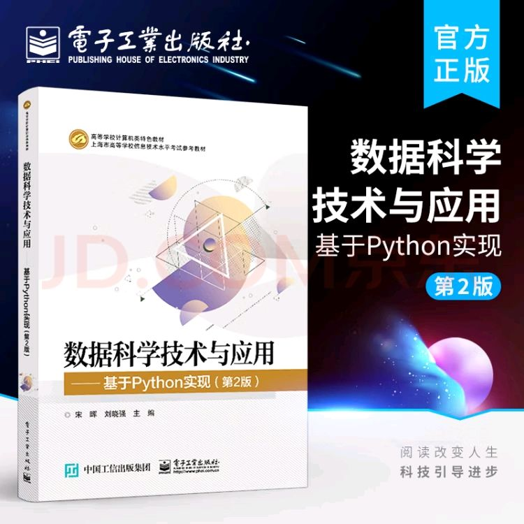

# 东华大学 软工 数据科学技术 + 机器学习 + 人工智能材料汇总
## 数据科学技术
- 教材采用 《数据科学与应用——第二版》

- 课本所有代码在 [书本内容](dataScience%2F%E4%B9%A6%E6%9C%AC%E5%86%85%E5%AE%B9) 中
- 所有课后习题代码在 `dataScience/1.1~5`中
- 大作业在 [final_homework](dataScience%2Ffinal_homework)中
- 文件夹中有一些参考样卷
> 教学内容为:python基础/常用的分类,聚类库的使用(不涉及原理)如KNN,随机森林,PCA等
## 机器学习
- 教材采用 《统计学习方法》——李航
- 章节代码在 [machineLearning](machineLearning)文件夹中
- 大作业在 [machine_learing_final](machineLearning%2Fmachine_learing_final)中
- 可以在 [wolai-机器学习](https://www.wolai.com/6iFsx1x3ryXWEheHEWTENA)中找到所有的理论推导过程和课后习题的详细答案
>教学内容为 KNN,朴素贝叶斯,感知机,线性回归,逻辑回归,KD树,C4.5,CART算法,随机森林,XGBOOST,聚类算法,PCA等,涉及理论推导过程
> 考试内容为闭卷,选择+填空+大题
## 人工智能
- 教材采用 《人工智能与应用》
- 作业代码在[Articifical Intelligence](Articifical%20Intelligence)中
- 内涵开卷材料汇总
- 尽量选**肖ll**老师的课!!!!!人好